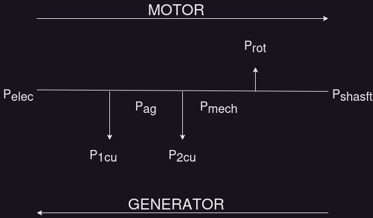

### Notes by txddy-p
The idea here is to remove the fluff and get to the meat and bones of this

### Modes of operation
Which way is the power flowing in a machine. Is the machine delivering power (Genarator) or is it using power(Motor)

### Concentrated winding
 

- The output is non sinusoidal because the harmonic flux densities induce harmonic voltages in the winding
- The problems associated with this configuration are:
	- Large portions of the stator remain unused
	- 2 large slots are needed to fit the coil sides in
	- The output is square because of all the harmonic content
	- Harmonic core losses (Eddy, Hysteresis, stray)

###### Disadvantages
- Require large slot sizes to accommodate the coils sides, a large  portion of the stator/rotor is then left unused.  
- MMF distribution is a square wave, so the flux density will also be a square wave. This leads to odd harmonics which produce additional losses in the machine such as heat.
 

### Distributed winding
- The harmonic content can be decreased if the winding is distributed over several slots
![[Pasted image 20230606113534.png]]

Coil sides in several slots around periphery of stator
- Stepped MMF / Flux Density distribution
    - Resembles desired Sinewave
    - Less harmonics than Square-wave in concentrated winding
- Large portion of stator utilised
- Full-pitch coils
    - Coil sides in diametrically opposite slots

###### Advantages
- Large portion of stator is utilised, coils can be fully-pitched or short- pitched
- MMF distribution is stepped in shape and better resembles a sinusoidal MMF distribution. This is what we assume in an “Ideal” three – phase machine. This provides  smoother torque and less speed pulsations.
- Distributed windings make better use of the rotor/stator structure and reduce harmonics.

 
- A turn has 2 conductors associated with it and both lie in the same plane. N turns = 2N conductors
- A coil is several turns together
- A winding is several coils together
- MMF associated with the winding is perpendicular to the plane in which the coils are located
- Axis of the winding is perpendicular to the plane in which the coils are located 

# Module 3
#### Winding arrangements
- Full pitch coil 
	- is one where the coil spans 180°ed.
	- coil sides in diametrically opposite slots
- Short-pitch coils:
    - Coil pitch $(\tau_c)$: (180 − 𝛾)°ed < Pole pitch ($\tau_p$): (180°ed)
 
Why?
Shorter end connections:
- Results in less copper
    - => Lower copper loss
- Also less leakage flux associated with end connection
- More economic because less copper is used
 
  
 
#### Single-layer winding
- `1 conductor per slot`
- n = slots/pole/phase means `(slots/pole)/phase)` essentially slots divided by the product of pole and phase

#### Double-layer winding
- `2 conductors per slot`
- Greater flexibility can be achieved with double layer winding as coil span can be easily  selected which makes it easier for simpler end connection.

 

- Consider current in the conductors and use the right hand grip rule to determine the direction of MMF and eventually you can tell how many poles there are
- Thus using the winding configuration and polarity you can determine how many poles the machine has
- 
- 3 phase Distributed winding: Full Pitch
-  
Assume the coil sides at the top half carry current outside the page which means a magnetic field in the anticlockwise direction i.e. in the direction of the axis of phase A

The plane(on average) on which coil sides are located is perpendicular to the axis of the winding and produce an MMF in thee direction of the axis of the winding
 
 
  
 
  

- One winding for each phase
- Axes of phase windings displaced by 120°elec
- Identical coil configuration used for other windings
- Coil sides of other phase windings shown

  
Planes of phase windings displaced by 120°elec... (Plane of each winding is perpendicular to axis of winding)

 

- 3-Phase Distributed Winding: Short-pitch
 

## Induced Voltage in Stator winding
![[Pasted image 20230329191410.png]]
$$\begin{aligned} 
B(\theta) &= B_{max}\cos{\theta}\\
\phi_p &= \int B.\,dA = \int_{-\frac{\pi}{2}}^{\frac{\pi}{2}} B_{max}\cos{\theta}\,dA = \int_{-\frac{\pi}{2}}^{\frac{\pi}{2}} B_{max}\cos{\theta}lr\,d\theta\\
&=B_{max}lr \int_{-\frac{\pi}{2}}^{\frac{\pi}{2}} \cos{\theta}\,d\theta\\
\Rightarrow \phi_p &= 2B_{max}lr\\
\lambda_a(t) &= \lambda_{max}\cos{\omega t} = N\phi_p \cos{\omega t}\\
e_a(t) &= \frac{\mathrm{d} \lambda_a}{\mathrm{d} t}=\omega N \phi_p \sin{\omega t}\\
E_{rms} &= \frac{E_{max}}{\sqrt{2}}=\frac{2\pi f}{\sqrt{2}}N\phi_p = \sqrt{2}\pi fN\phi_p = 4.44fN\phi_p
\end{aligned}
$$
## $$E = 4.44 \cdot f\cdot N\cdot \phi_p$$
What’s the difference in induced voltage/phase for 2  configurations below?
![[Pasted image 20230329193614.png]]

- Winding factor ($K_w < 1$) used to calculate reduction in emf
### $$E = 4.44 \cdot f\cdot N\cdot \phi_p \cdot K_w$$
- Winding factor ($K_w <1$), depends on:  
	- How coils are distributed, i.e. **Distribution factor ($K_d <1$)**  
	- How coils are pitched, i.e. **Pitch factor ($K_p <1$)**
### $$E = 4.44\cdot f\cdot N\cdot \phi_p \cdot K_p \cdot K_d$$
For a concentrated winding of N turns per phase, the rms voltage induced in each phase is  
### $$E = 4.44 \cdot f \cdot N \cdot \Phi_p$$

![[Pasted image 20230329194937.png]]

## Coil voltages in Distributed Winding  

- Distribution factor (K d <1):  
	- Used to calculate reduction in emf  
	- Depends on how coils distributed

![[Pasted image 20230329195201.png]] 
$$\begin{aligned} 
K_d &=\frac{\sin{\left( n\cdot \frac{\alpha}{2} \right)}}{n\cdot \sin{(\frac{\alpha}{2})}};\\
\alpha - &\text{is the slot angle}\\
n - &\text{is \# of slots/pole/phase}
\end{aligned}
$$

## Coil voltages in full- and short-pitch coils
- Pitch factor (K p <1)  
	- Used to find reduction in emf  
	- Depends on how coils pitched

$$
\begin{aligned} 
K_p &= \cos{(\frac{\gamma}{2})};\\
\gamma - &\text{is short-pitch angle}
\end{aligned}
$$

![[Pasted image 20230329200926.png]] ![[Pasted image 20230329200945.png]]

- For full-pitch coil both e1 and e2 are maximum at the same instant (and always in series)  
- For short-pitch coil, when e1 is maximum, e2 is not maximum

# Module 4 IM intro

## Laminations of Magnetic Circuit
![[Pasted image 20230329203310.png]]

- Uniform airgap
- Laminated stator
- Laminated rotor of ferromagnetic material (high $\mu_𝑟$)

## Stator Electrical Circuit

![[Pasted image 20230329203958.png]]

## Balanced 3-phase currents

- Balanced 3-phase currents drawn from mains supply  
- Currents phase displaced by 120$\degree$ in time  
- Same amplitude, frequency

![[Pasted image 20230330173002.png]]

## Pulsating MMF due to current in phase

- Each phase produces pulsating MMF along axis of winding  
- MMF has sinusoidal spatial distribution due to  distributed winding configuration  
- Amplitude of MMF dependent on instantaneous value of current

![[Untitled.png]]

- Pulsating mmf along axis of each winding; amplitude dependent on  instantaneous current in each phase; mmfs represented by phasors...

![[Pasted image 20230330173324.png]]

## Effect of 3 winding MMFs together

- Each phase produces sinusoidal  spatial MMF distribution, with peak along axis of winding  
- Amplitude of MMFs dependent on instantaneous value of currents

![[Screenshot from 2023-03-30 17-34-43.png]]

![[Pasted image 20230330173822.png]]

![[Pasted image 20230330173904.png]]

![[Pasted image 20230330173929.png]]

![[Pasted image 20230330173941.png]]

## Rotating magnetic field

- Rotating field has constant amplitude  
- Rotates at constant angular speed linked to line frequency

![[Pasted image 20230330174032.png]]

## Motional Voltage: $e = B \cdot l \cdot v$
## Electromagnetic Force: $f = B \cdot l \cdot i$

### Similarly in Induction Machine in Motor mode:  
- Torque on rotor in same direction as rotating field  
- Rotor dragged behind field  
- Rotor speed < speed of rotating field  
### Difference in speed required for:  
➢ Emf to be induced  
➢ Current to flow  
➢ Torque to be developed

- No torque developed when rotor at same speed as field

## Speed of Rotating magnetic field

### Synchronous Speed \[rpm\]

![[Pasted image 20230330180523.png]]

### Rotor speed:
$n < n_s$ in motor mode of operation

### Define slip as:

![[Pasted image 20230330180622.png]]

## Consider: Wound Rotor IM
### Stator:  
- Balanced 3-phase windings  
- Axes phase displaced by 120oed  
- Connected to balanced 3-phase mains supply  
- Rotating magnetic field established in airgap due to currents in stator windings
- Field rotates at synchronous speed,  related to mains frequency  
### Rotor:  
- Balanced 3-phase windings  
- Axes phase displaced by 120oed  
- Windings short circuited or connected to external circuit by slip- rings  

- Find Emf induced in stator and rotor phase windings !?

![[Pasted image 20230330181349.png]]

#### Recall: $E = 4.44 \cdot f \cdot N \cdot \phi_p \cdot K_w$

## Stator Induced Emf

## $$E_1 = 4.44\cdot f_1\cdot N_1 \cdot \phi_p \cdot K_{w1}$$
$$\begin{aligned}
&f_1 \text{ ... is the mains frequency in [Hz],  where }f_1 = \frac{p}{120}\cdot n_s\\
&N_1 \textbf{ ... is the number of turns/phase of the stator winding}\\
&\phi_p \text{ ... is the flux per pole in [wb]}\\
&K_{w1} \textbf{ ... is the stator winding factor}
\end{aligned}
$$

## Rotor Induced Emf (rotor at standstill):

## $$E_2 = 4.44\cdot f_1\cdot N_2 \cdot \phi_p \cdot K_{w2}$$
$$\begin{aligned}
&f_1 \text{ ... is the mains frequency in [Hz],  where }f_1 = \frac{p}{120}\cdot n_s\\
&N_2 \textbf{ ... is the number of turns/phase of the rotor winding}\\
&\phi_p \text{ ... is the flux per pole in [wb]}\\
&K_{w2} \textbf{ ... is the rotor winding factor}
\end{aligned}
$$

## Rotor Induced Emf (rotor at speed: n):
Voltage induced in rotor phase winding is:
## $$E_{2s} = 4.44\cdot f_2\cdot N_2 \cdot \phi_p \cdot K_{w2}$$
$$
\begin{aligned}
&f_2 \equiv \text{ slip frequency  ...  is frequency of rotor circuit,}\\
&f_2 \propto \text{ slip speed = }(n_s-n) = s\cdot n_s\\
&f_2 = \frac{p}{120}\cdot (n_s -n)=s\cdot f_1
\end{aligned}
$$

$$
\begin{aligned}
\therefore E_{2s} &= 4.44 \cdot s \cdot f_1 \cdot N_2 \cdot \phi_p \cdot K_{w2}\\
&= s \cdot (4.44 \cdot f_1 \cdot N_2 \cdot \phi_p \cdot K_{w2})\\
\therefore E_{2s} &= s \cdot E_2
\end{aligned}
$$

![[Pasted image 20230330184504.png]]

## Rotor Induced Emf (rotor at speed: n):
- Rotor windings are short circuited.  
- 3 rotor phase currents 120 degrees displaced  
- 3 phase rotor windings has phase  displaced by 120 electrical degrees (ed) in  space

# Module 5 IM equivalent

## Principle of Operation of IM  
### Torque production mechanism:  
➢ When stator windings connected to (3-phase) mains supply, currents drawn by each stator phase winding.  
➢ Revolving field produced in air gap, which rotates at  synchronous speed.  
➢ Voltages induced in stator and rotor windings (like transformer).  
➢ If rotor circuit closed, induced voltages in rotor produces rotor currents.  
➢ Rotor currents interact with revolving field, producing torque on rotor structure.  
➢ Rotor rotates in direction of revolving field, but at speed less than synchronous speed (in motor mode).

### Direction of Rotation of Rotor:  
➢ Question: How can direction of rotation be changed?

### Change direction of rotation of rotor???  
#### ➢ Ans: 
- Change direction of rotation of revolving field. This will result in torque production in opposite direction.  
#### ➢ How: 
- Change phase sequence of supply to stator! e.g. Swop currents in phase B and C windings Thus, current in phase B lags C by 120 degr.  

![[Pasted image 20230330185651.png|500]]

## Power flow in stator: Motor Mode

![[Pasted image 20230330185739.png|250]]

## Stator

![[Pasted image 20230330185837.png]]

## Rotor
![[Pasted image 20230330185911.png]]

From the previous slide, the rotor current $I_2$ is:
### $$I_2 = \frac{sE_2}{R_2+jsX_2}$$
Which can be writen as 
### $$I_2 = \frac{E_2}{(\frac{R_2}{s})+jX_2}$$
Therefore, the rotor circuit converted to stator frequency $f_1$ can be drawn as shown below
![[Pasted image 20230330190901.png]]
$$\begin{aligned}
\text{Note that }\frac{R_2}{s} &=R_2 + \frac{R_2}{s}(1-s)\\
P_{ag} &= I^2_2\frac{R_2}{s}\\
P_{ag} &= P_{mech} + P_{Cu(Rot)}\\
P_{ag} &= \frac{I^2_2 R_2}{s}(1-s) + I^2_2R_2
\end{aligned}$$

## Exact Equiv circuit: Induction Motor
- The stator and rotor equivalent circuits at the same line frequency f1 can be joined  
- Refer rotor to stator using turns ratio (𝑎 = N1 / N2 )  
	- Where N1 is number of turns of the stator windings and N2 in number of turns of the rotor windings.

![[Pasted image 20230330191754.png|500]]

## Power flow: Motor Mode
- If $V_1$ and $f_1$ constant => $P_\text{1\_core}$ Constant  
- From no load to full load, 0 < s < $s_\text{rated}$ ; where $s_\text{rated}$ is: 3-7%  
- $P_\text{2 core}$ increases from no load to full load, since $f_2= sf_1$  
- $P_\text{friction \& windage}$ decreases from no load to full load  
- On average, sum of above losses remain constant
![[Pasted image 20230330192359.png|450]]

## IEEE Recommended Circuit

![[Pasted image 20230330193256.png|500]]

![[Pasted image 20230330193649.png]]

![[Pasted image 20230330193844.png]]

![[Pasted image 20230330193928.png]]

## Equivalent Cct Parameter Determination  
- 2 Tests are performed  
	- No-load test (Open cct test)  
	- Locked rotor test (Short cct test)

### No-load Test of Induction Motor  
- IM uncoupled from load  
- Rated voltage on stator at line frequency  
- Measure: input voltage, current, power

![[Pasted image 20230330194128.png|500]]

![[Pasted image 20230330194205.png]]

### Locked Rotor Test  
- IM rotor locked  
- Low voltage on stator, but rated current  
- Measure: input voltage, current, power

![[Pasted image 20230330194308.png|500]]

![[Pasted image 20230330194327.png|500]]

![[Pasted image 20230330194414.png]]

# Perfomance Characteritics
## Torque

![[Pasted image 20230606191228.png]]

![[Pasted image 20230606191337.png]]

![[Pasted image 20230606191556.png]]
 This is the total developed Torque

![[Pasted image 20230606191728.png]]

### Performance: Slip at Maximum Torque

![[Pasted image 20230606192000.png]]
Obtained from impedance matching ($Z_{source} = Z_{load}$)
$Z_{source} = \left | R_{th} + j(X_{th} +X^{'}_{2}) \right |$
$Z_{load} = \left | \frac{R_{2}^{'}}{s}\right |$

### Performance: Max Torque

![[Pasted image 20230606192641.png]]

#### Effect of increasing rotor resistance
![[Pasted image 20230606192757.png]]

#### Effect of decrease in supply voltage:
![[Pasted image 20230606193000.png]]
- Supply voltage is shifted down because shifting it above rated voltage will damage the machine

### Performance: Stator Current
![[Pasted image 20230606193446.png]]

![[Pasted image 20230606193643.png]]

![[Pasted image 20230606194002.png]]

#### Performance: Power Factor
- IM always operates at lagging PF
- PF becomes very poor during no load or light load operation

#### Performance: Actual Efficiency
![[Pasted image 20230606194623.png]]

#### Performance: Ideal Efficiency
![[Pasted image 20230606194755.png]]

![[Pasted image 20230606194859.png]]

![[Pasted image 20230606194920.png]]

### [[Synchronous Machines Notes]]
