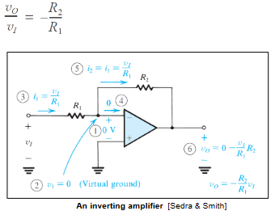

# Semana 2
## Op-amps
### Ideal op-amps

$$\text{Output given by: } V_O = A(V^+-V^-)$$

| Characteristic                            | Ideal Op-amp                     | Practical Op-amp          |
|------------------------------------------|----------------------------------|---------------------------|
| Input Impedance ($Z_{in}$)                | $\infty$                         | High: a few M$\Omega$      |
| Open-loop Gain ($A_V$)                    | $\infty$                         | High: 100,000 to 1,000,000 |
| Output Impedance ($Z_{out}$)              | 0                                | Low: < 100 $\Omega$        |
| Bandwidth                                 | Infinite                         | Very low: 10 Hz            |

### Comparator
Compares the 2 input voltages and returns a squarewave on its output
$$
\begin{align*}
V_{out} = A(V^+-V^-)=A(V_{REF}-V_{in})\\ 
\text{If }V_{in}>V_{REF}\text{, then }V_{out}=+V_{cc} \\ 
\text{If }V_{in}< V_{REF}\text{, then }V_{out}=-V_{cc}
\end{align*}
$$

The limitation to this setup however is that gain cannot be set. The high open loop gain gives rise to a distorted signal. An input of a sine wave results in a square wave at the output

## Negative Feedback

Used to improve the properties of practical op-amps

- The gain of the op-amp amplifier circuit can be set to a fixed value. Note: the open-loop gain still remains a high value
- Increase the input impedance of the circuit
- Decrease the output impedance of the circuit
- Increase the bandwidth of the op-amp amplifier circuit

### Non-inverting op-amp
$$ \begin{align} V^+&=V^-\\ V^-&=V_I\\ I_{R_{1}}&=\frac{V_I}{R_1}\\ I_{R_{2}}&=\frac{V_I}{R_1}\\ V_O&=V_I+R_2(\frac{V_I}{R_1})\\ \frac{V_O}{V_I}&=(1+\frac{R_2}{R_1}) \end{align}

$$

### Inverting amplifier

### Difference Amplifier
$$
\begin{align*}
&\text{In order to express Vo, we apply the superposition principle}\\ &v_{01}=-\frac{R_2}{R_1}v_{I1}\\ 
&\text{Then, set }v_{I1} = 0\text{ and express Vo in terms of }v_{l2}\\ &v_{02}=\frac{R_2}{R_1}v_{I2}\\ 
&\text{The output voltage is the sum of }V_{01}\text{ and }V_{02}\\ 
&v_0 =\frac{R_2}{R_1}(v_{I2}-v_{I1})
\end{align*}
$$

